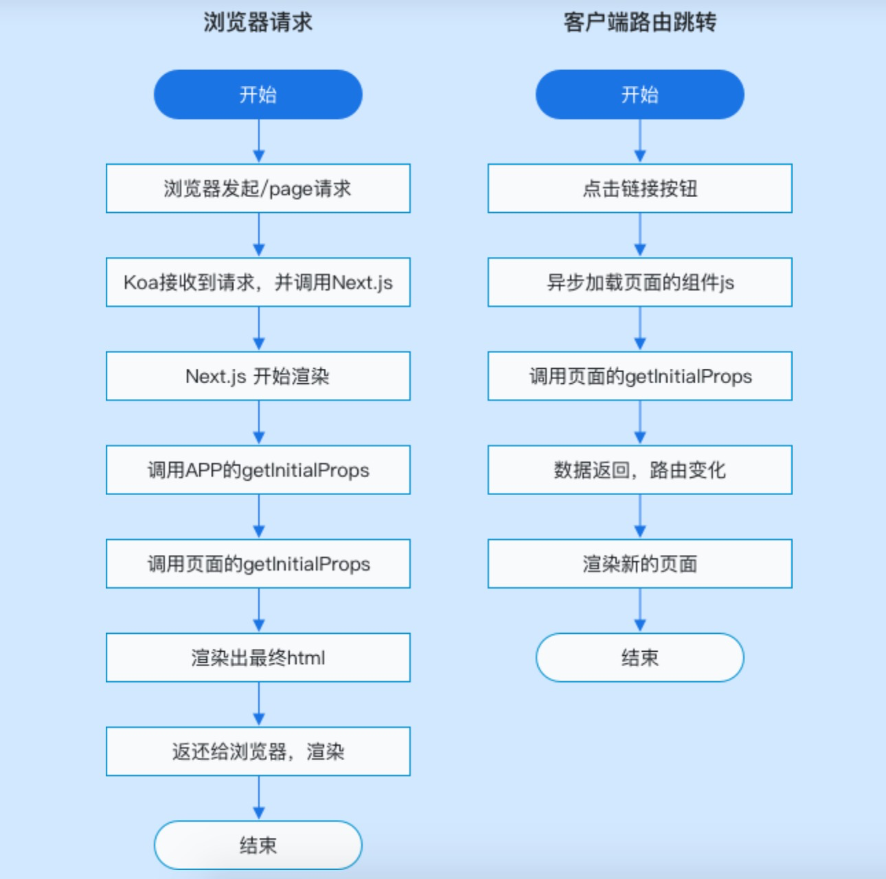

# 教你玩转react、next、hooks 、koa、antd


#### 前言
以下文章纯属个人理解，便于记录学习，肯定有理解错误或理解不到位的地方，
意在站在前辈的肩膀，分享个人对技术的通俗理解，共同成长！

> Next.js 是一个轻量级的 React 服务端渲染应用框架。

> 官方网站：https://nextjs.org  

> 中文官网：https://nextjs.frontendx.cn

> API: https://developer.github.com/apps/building-oauth-apps/authorizing-oauth-apps/

`当使用 React 开发系统的时候，常常需要配置很多繁琐的参数，如 Webpack 配置、Router 配置和服务器配置等。
如果需要做 SEO，要考虑的事情就更多了，怎么让服务端渲染和客户端渲染保持一致是一件很麻烦的事情，
需要引入很多第三方库。针对这些问题，Next.js 提供了一个很好的解决方案，使开发人员可以将精力放在业务上，
从繁琐的配置中解放出来。下面我们一起来从零开始搭建一个完善的 next 项目`

> Author:君吟

> Email: 506499594@qq.com  

> github: https://github.com/zmj0920/


#### 运行
```
npm run dev

```

#### 目录结构
```
├── components           非页面级共用组件
│   └── Layout.jsx       路由配置文件
├── lib                  一些通用的js
│   └── with-redux.js    继承redux
├── pages                页面级组件 会被解析成路由
│   └── _app.js          自定义 app配置
│   └── _document.js     自定义 document 配置
│   └── index.js         首页
├── static               静态资源
├── test                 测试文件 
├── babelrc              babel 编译配置
├── gitignore            git不需要上传文件配置
├── next.config.js       next 相关配置
├── package.json         项目依赖配置文件
├── README.md            项目说明文件
├── server.js            服务端文件
```


## ssr 流程

